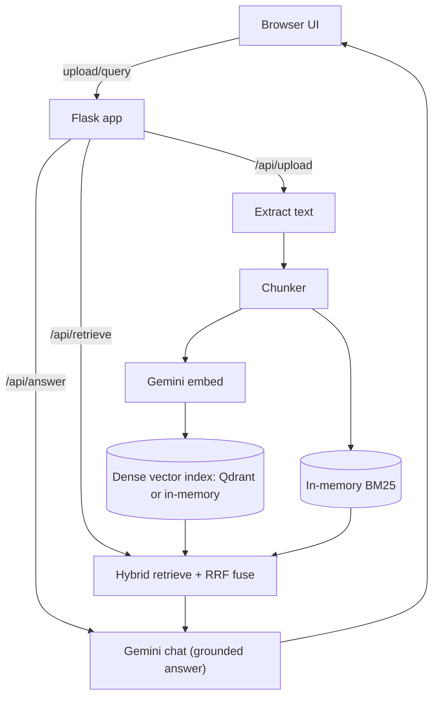

# RAG Console

Minimal Flask RAG app for uploading a document, indexing it locally, and asking questions with citations.

## Features
- Upload and index a single source (PDF/DOCX/TXT/MD/CSV/JSON/HTML/XML).
- Hybrid retrieval: dense embeddings (Gemini) + BM25, fused with RRF.
- Top matches view plus grounded answers with numbered citations.
- Evidence preview: click a citation or a match card to open the referenced chunk.
- Ingestion progress UI (upload, extract, chunk, embed, index).
- Optional: use Qdrant for the dense vector index.

## Architecture

Note: `architecture.md` may be out of date; this README reflects the current code paths.

## Configuration
Copy `.env.example` to `.env`. Key settings:
- `GOOGLE_API_KEY` (required)
- `MAX_UPLOAD_MB` (default `250`)
- `CHUNK_MAX_TOKENS` (default `512`)
- `CHUNK_OVERLAP_TOKENS` (default `32`)
- `GEMINI_EMBED_MODEL` (default `text-embedding-004`)
- `GEMINI_CHAT_MODEL` (default `gemini-2.5-flash`)
- `MAX_EMBED_REQUESTS_PER_MINUTE` (default `0` = disabled; limits embedding API requests/minute)
- `FLASK_HOST` (default `0.0.0.0`)
- `FLASK_PORT` (default `5000`)
- `FLASK_DEBUG` (default `0`)
- `QDRANT_URL` (optional, e.g. `http://localhost:6333`)
- `QDRANT_COLLECTION` (optional, default `rag_chunks`)
- `QDRANT_API_KEY` (optional)
- `QDRANT_RECREATE_COLLECTION` (optional, default `1`)

Query tuning defaults live in `webapp/config.py` (`QuerySettings`).

## Pipeline
1. Upload + extract text (PDF/DOCX/TXT/etc).
2. Chunk + embed (Gemini), build a dense index (Qdrant or in-memory) + in-memory BM25.
3. Query uses hybrid retrieval + RRF fusion, then the LLM answers with chunk citations (shown in the UI).

Important: the app still keeps chunk text/ordering in process memory for the active upload. Qdrant currently replaces only
the dense similarity search component.

## Run
1. Create a virtualenv and install deps:
   - `python3 -m venv .venv`
   - `source .venv/bin/activate`
   - `pip install -r requirements.txt`
2. Set your Gemini key:
   - `cp .env.example .env`
   - edit `.env` and set `GOOGLE_API_KEY`
3. (Optional) Start Qdrant locally:
   - `docker run -d --name rag-qdrant -p 6333:6333 -v "$(pwd)/qdrant_storage:/qdrant/storage" qdrant/qdrant`
   - set `QDRANT_URL=http://localhost:6333` in `.env`
4. Start the server:
   - `python3 app.py`
5. Open:
   - `http://localhost:5000`
